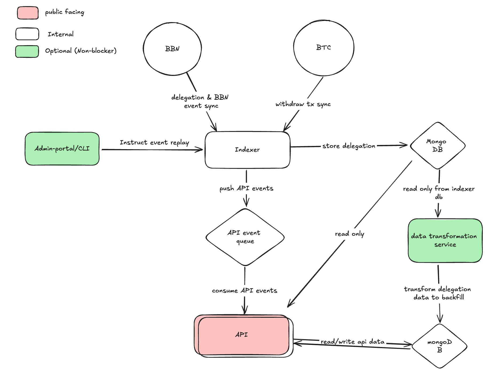

# Babylon BTC Staking Indexer

## Overview

The **Babylon BTC Staking Indexer** is a core component of the 
Babylon blockchain’s staking architecture, responsible for syncing delegation 
and finality provider events from both the **Babylon blockchain (BBN)** and 
**Bitcoin (BTC)**. It processes, stores, and transforms on-chain events into 
API-friendly data structures, enabling the Babylon Staking API to efficiently 
serve staking-related data to the frontend.

### Key Responsibilities

- **Delegation Sync**: Syncs delegation and Babylon&BTC-related events, storing them in 
MongoDB for easy retrieval.
- **Finality Provider Sync**: Tracks and updates the state of finality providers
 (FPs), including status changes, creation, and edits.
- **Global Parameters Sync**: Syncs global parameters necessary for the staking 
mechanism.

## Architecture

Key principles:
- Events are processed in sequential order based on the block height
- Events within the same block height can be replayed and processed again
without affecting the final state

The Babylon Indexer interacts with the following components:

- **BBN (Babylon Blockchain)**: Receives delegation and finality provider events
 via Cosmos CometBFT `/block_results` (over gRPC for better performance), as well
 as websocket subscriptions for events.
- **BTC (Bitcoin)**: Syncs withdrawal transactions and other BTC-related events.
- **MongoDB**: Serves as the storage layer where delegation, global parameters 
and finality provider data is stored.
- **API Event Queue**: The indexer pushes API-related events into a queue 
(RabbitMQ), consumed by the Babylon API for frontend-facing operations.



## Synchronization Process

The workflow involves:

1. **Bootstrap Process**: The indexer starts by syncing all events from the 
last processed Babylon block height to the latest height. 
This is a continuous process until the indexer catches up with the most recent block.
2. **Real-time Sync**: After catching up, the indexer subscribes to 
real-time WebSocket events for ongoing synchronization.
3. **Raw Data Synchronization**: The indexer primarily handles the 
synchronization of:
   - **Delegation**: Storing and tracking delegation data.
   - **Finality Provider**: Monitoring state changes and updates for 
   finality providers.
   - **Global Parameters**: Syncing parameters relevant to staking, unbonding, 
   and slashing.

4. **RabbitMQ Messaging**: When a state change occurs in any delegation, 
the indexer emits a message into RabbitMQ. This allows the Babylon API to 
perform metadata and statistical calculations, such as total value locked (TVL) 
computations.
5. **Bitcoin Node Sync**: The indexer also syncs with the Bitcoin node to 
check if delegations are in a withdrawn state, ensuring accurate tracking of 
withdrawal transactions.

## Installation & Setup

### Requirements

- **Go**: Version `1.24.3` or higher is required.
- **MongoDB**: A MongoDB instance with replica sets enabled is required

1. Clone the repository

```bash
git clone git@github.com:babylonlabs-io/babylon-staking-indexer.git
cd babylon-staking-indexer
```

2. Install dependencies

```bash
go mod tidy
```

3. Run the service

```bash
make run-local
```


## Documentation

Detailed documentation is available in the [docs](./docs) directory:

### State Transition Overview


This diagram shows the state transition lifecycle in the indexer. For detailed documentation:

### Flows
- [Startup Process](./docs/flows/startup.md)
- [Event Processing](./docs/flows/event-processing.md)

### States
- [State Definitions](./docs/states/overview.md)
- [State Lifecycle](./docs/states/lifecycle.md)