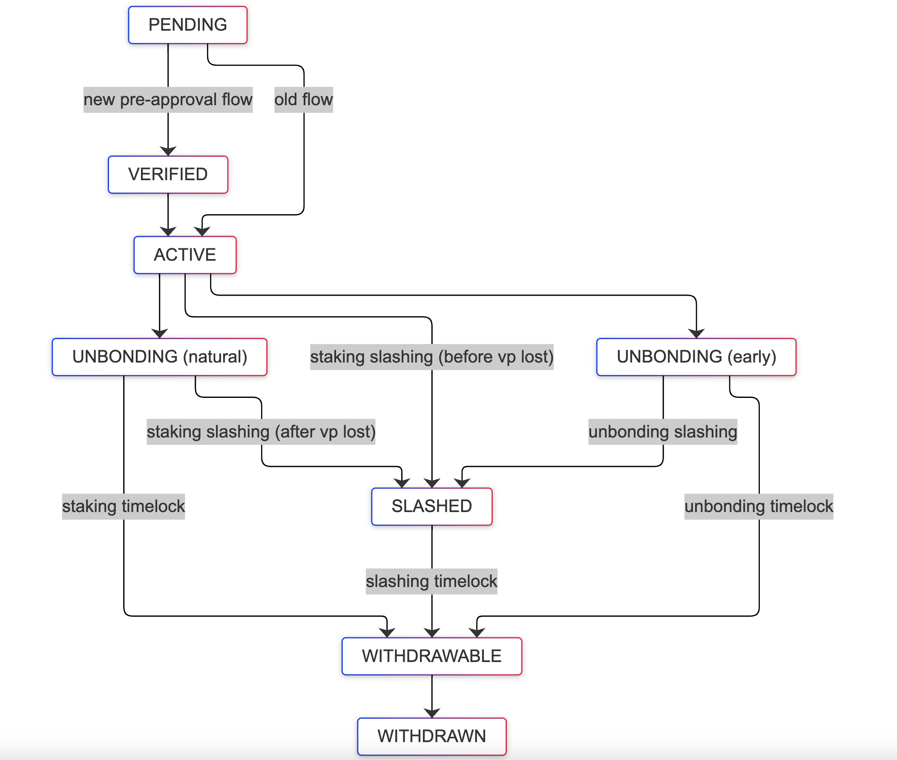

# Delegation Lifecycle

## State Transition Diagram

## Notation

Throughout this document, we use the notation `State(SubState)` to represent both the main state and its associated sub-state:
- **State**: The primary delegation state (PENDING, VERIFIED, ACTIVE, UNBONDING, WITHDRAWABLE, WITHDRAWN, SLASHED, EXPANDED)
- **SubState**: Additional context about how the delegation reached this state (TIMELOCK, EARLY_UNBONDING, TIMELOCK_SLASHING, EARLY_UNBONDING_SLASHING)

States without parentheses (like PENDING, VERIFIED, ACTIVE, EXPANDED) do not have sub-states.

For detailed sub-state definitions, see [State Overview Documentation](./overview.md#sub-state-definitions).

## Staking Output Spent

### 1. Timelock Path (Natural Expiration)
**Flow**
`Pending -> Verified -> Active -> Unbonding(TIMELOCK) -> Withdrawable(TIMELOCK) -> Withdrawn(TIMELOCK)`

**Description**
- Normal delegation lifecycle via natural expiration
- Triggered by `EventBTCDelegationExpired` when staking reaches end height
- Staking output spent via timelock path after expiration
- Sub-state remains `TIMELOCK` throughout

---

### 2. Slashing Path (Staking Output Slashed)
**Flow**
`Pending -> Verified -> Active -> Slashed(TIMELOCK_SLASHING) -> Withdrawable(TIMELOCK_SLASHING) -> Withdrawn(TIMELOCK_SLASHING)`

**Description**
- Staking output spent via slashing path
- Occurs when finality provider is slashed while delegation is ACTIVE
- Sub-state is `TIMELOCK_SLASHING` because staking tx was slashed

---

### 3. Early Unbonding Path

When staker initiates early unbonding and unbonding transaction is submitted to Bitcoin:

#### a. Unbonding Output Spent via Timelock
**Flow**
`Pending -> Verified -> Active -> Unbonding(EARLY_UNBONDING) -> Withdrawable(EARLY_UNBONDING) -> Withdrawn(EARLY_UNBONDING)`

**Description**
- Staker requests early unbonding
- Triggered by `EventBTCDelegationUnbondedEarly` or BTC notifier detecting unbonding tx
- Unbonding output spent via timelock path after unbonding period expires
- Sub-state remains `EARLY_UNBONDING` throughout

#### b. Unbonding Output Spent via Slashing
**Flow**
`Pending -> Verified -> Active -> Unbonding(EARLY_UNBONDING) -> Slashed(EARLY_UNBONDING_SLASHING) -> Withdrawable(EARLY_UNBONDING_SLASHING) -> Withdrawn(EARLY_UNBONDING_SLASHING)`

**Description**
- Staker requests early unbonding
- Unbonding output spent via slashing path (finality provider slashed during unbonding)
- Sub-state changes from `EARLY_UNBONDING` to `EARLY_UNBONDING_SLASHING` when slashed

---

### 4. Expansion Path
**Flow**
`Pending -> Verified -> Active -> Expanded`

**Description**
- Delegation is expanded/extended to a new delegation with an extended timelock
- Staker spends the staking output as input to a new staking transaction (with extended timelock + funding UTXO for fees)
- Allows extending the staking period without going through unbonding and restaking
- Currently supports extending timelock duration only (not increasing stake amount)
- Terminal state with no sub-state

## Special Cases

### 1. When BTC notifier is faster than Babylon events and expiry checker

**Possible Flows**

Timelock path:
`Pending -> Verified -> Active -> Withdrawn(TIMELOCK)` (skipping Unbonding, Withdrawable)

Slashing staking output:
`Pending -> Verified -> Active -> Slashed(TIMELOCK_SLASHING) -> Withdrawn(TIMELOCK_SLASHING)` (skipping Withdrawable)

Early unbonding path:
`Pending -> Verified -> Active -> Unbonding(EARLY_UNBONDING) -> Withdrawn(EARLY_UNBONDING)` (skipping Withdrawable)

Early unbonding slashing:
`Pending -> Verified -> Active -> Unbonding(EARLY_UNBONDING) -> Slashed(EARLY_UNBONDING_SLASHING) -> Withdrawn(EARLY_UNBONDING_SLASHING)` (skipping Withdrawable)

**Description**
- BTC notifier detects spending transactions on Bitcoin before Babylon events or expiry checker processes them
- Results in skipping intermediate states (UNBONDING and/or WITHDRAWABLE)
- The system is designed to handle these race conditions gracefully
- Sub-states are still correctly set based on which transaction was spent and how

**Why This Happens**:
- Babylon events may be delayed or temporarily unavailable
- Expiry checker polls periodically, so there's a time window where timelocks expire but state hasn't updated
- BTC notifier watches Bitcoin blocks in real-time and can detect spending immediately

---

### 2. When staker forgets to withdraw (Post-Expiry Slashing)

**Flows**

After timelock expiration:
`Pending -> Verified -> Active -> Unbonding(TIMELOCK) -> Withdrawable(TIMELOCK) -> Slashed(TIMELOCK_SLASHING) -> Withdrawable(TIMELOCK_SLASHING) -> Withdrawn(TIMELOCK_SLASHING)`

After early unbonding expiration:
`Pending -> Verified -> Active -> Unbonding(EARLY_UNBONDING) -> Withdrawable(EARLY_UNBONDING) -> Slashed(EARLY_UNBONDING_SLASHING) -> Withdrawable(EARLY_UNBONDING_SLASHING) -> Withdrawn(EARLY_UNBONDING_SLASHING)`

**Description**
- Staker doesn't withdraw funds after timelock/unbonding period expires
- Finality provider gets slashed while funds are still in staking/unbonding output
- Delegation transitions to SLASHED state even though it was WITHDRAWABLE
- Sub-state transitions from `TIMELOCK` → `TIMELOCK_SLASHING` or `EARLY_UNBONDING` → `EARLY_UNBONDING_SLASHING`
- After slashing timelock expires, becomes WITHDRAWABLE again (with slashing sub-state)
- Eventually withdrawn with slashing sub-state

**Important Note**: Even if timelock has expired, funds are still subject to slashing if not withdrawn. Stakers should withdraw promptly when delegation becomes withdrawable.
